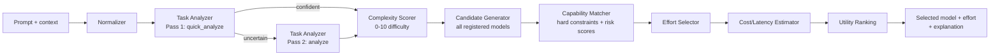

# RouteIQ

A routing layer that picks which Claude model (and reasoning effort) to send a given prompt to, based on an estimate of how hard the task actually is, instead of hardcoding one model for every request.

## The problem

Once an app calls more than one model tier, someone has to decide which request goes where. Hardcoding everything to the strongest model works but wastes money and latency on the trivial majority of requests. Hardcoding everything to the cheapest model is fast and cheap until it silently fails on the requests that actually needed more reasoning. Most teams pick one of these two and eat the cost. RouteIQ tries to make that decision automatically, per request, and explain why it made the call it did.

## How routing works

A prompt goes through two passes. Pass 1 (`app/analysis/task_analyzer.py::quick_analyze`) runs a cheap pass: it classifies the prompt into one or more of 20 task categories (coding, debugging, math reasoning, agentic, multimodal, etc.) using weighted vocabulary and structural signals, not simple keyword matching, and produces a rough difficulty estimate. If that estimate is uncertain, meaning it's near a tier boundary, the prompt is short, it contains code, or high-stakes language is present, Pass 2 runs the full 19-dimension requirement extraction (`analyze`). Otherwise the router builds an approximate result from Pass 1 and skips the expensive pass. This keeps the router's own overhead roughly proportional to how much the decision matters.

The 19 requirement dimensions (`reasoning_depth`, `coding_complexity`, `ambiguity`, `reliability_requirement`, and so on) are combined by `complexity_scorer.py` into one 0-10 difficulty score. It's a weighted blend of the top 3 elevated dimensions rather than an average across all of them, so a task that's extreme on one axis (a pure math proof, say) isn't diluted by dimensions that are legitimately zero for it.

Every registered model (`config/models.yaml`, currently the four current Claude tiers) is scored against the task in `capability_matcher.py`. Hard constraints eliminate a model outright: it lacks vision but the task needs it, its context window is too small, it doesn't support tool calling but the task requires that. Survivors get a `quality_estimate` (from the gap between what the task needs and what the model's registry scores claim it has), plus `overkill_risk` and `underpowered_risk`. The router then ranks survivors by:

```
utility = quality_estimate
        - 0.25 * normalized_cost
        - 0.15 * normalized_latency
        - 0.35 * overkill_risk
        - 0.45 * underpowered_risk
```

Cost and latency are normalized against the current candidate set, not a fixed constant. Reasoning effort (`low`/`medium`/`high`/`xhigh`/`max`, matching the real Claude API's `output_config.effort` scale) is picked independently of the model from the same difficulty signals, then clamped to whatever the selected model actually supports.

Every decision comes with a text explanation and the rejection reason for each alternative considered, which is the point: a router nobody can audit isn't trustworthy.

## Architecture



## Results

`app/evaluation/dataset.py` has 24 hand-labeled prompts spanning easy through very-hard, plus six adversarial cases built to defeat a naive keyword or length-based router (short-but-hard, long-but-trivial, keyword-heavy-but-easy, a vision-required prompt that reads as plain text). Running `scripts/run_evaluation.py` against the current heuristics gives:

```
Routing accuracy:     70.8%
Underpowered rate:    29.2%
Overkill rate:        0.0%
Cost vs. always-strongest-model: 88.2% savings
```

Every miss is underpowered, never overkill: the router is conservative on cost by design, so a few genuinely hard prompts (an autonomous agentic system design, "prove P != NP") land one tier below their label. The 0% overkill rate held even against the adversarial traps. These are self-labeled numbers on a 24-case dataset I wrote, not an external benchmark, so treat them as a sanity check on the router's own stated goal rather than a general accuracy claim.

`POST /evaluate/tournament` can run one prompt against every registered model for side-by-side comparison, but that still goes through `MockProvider`, so it isn't evidence of anything beyond internal consistency. A separate project, [ModelBench](https://github.com/pelumiibiks-cell/ModelBench), does the same comparison against real model calls on a pytest-graded coding benchmark; it doesn't call RouteIQ's `/route` endpoint, so it isn't a validation of this router specifically, just a related result pointing the same direction.

## Limitations

- Task analysis is rule-based (vocabulary and structural signals), not an LLM call. There's an `LLMBackedAnalyzer` stub behind the same interface, but it isn't implemented.
- `quality_estimate` is a capability-gap heuristic computed from the model registry's own scores, not measured against real model output quality.
- The registry only covers four Claude models. Adding a model is a YAML edit, but nothing here has been run against a wider model catalog.
- The 24-case eval dataset and its tier labels are my own judgment calls, not an external ground truth.
- No production traffic has gone through this. The telemetry table (`RoutingRecord`, `/feedback`) exists to eventually support a learned routing policy, but nothing currently trains on it.

## Installation

```bash
python -m venv .venv
.venv/Scripts/activate   # or source .venv/bin/activate on macOS/Linux
pip install -r requirements.txt

PYTHONPATH=. uvicorn app.main:app --reload
# -> http://localhost:8000/docs      (OpenAPI)
# -> http://localhost:8000/dashboard (dashboard)
```

Or with Docker: `docker compose up --build`.

## Usage

```
POST /route
{
  "prompt": "...",
  "context": "",
  "attachments": [],
  "constraints": {"max_cost": 0.05, "max_latency_ms": 5000, "minimum_quality": 0.8}
}
```

Returns the selected model and effort, the difficulty score and dimension breakdown, cost/latency estimates, overkill/underpowered risk, ranked alternatives, and a text explanation.

```
POST /feedback           record actual quality/cost/latency/success against a routing decision
GET  /models              current model registry
GET  /evaluate/benchmark  run the labeled evaluation dataset
POST /evaluate/tournament run one prompt against every registered model (mock execution)
```

## Testing

```bash
PYTHONPATH=. pytest
```

34 tests across unit, routing, effort, adversarial edge-case, and API coverage, all passing as of this write-up.
